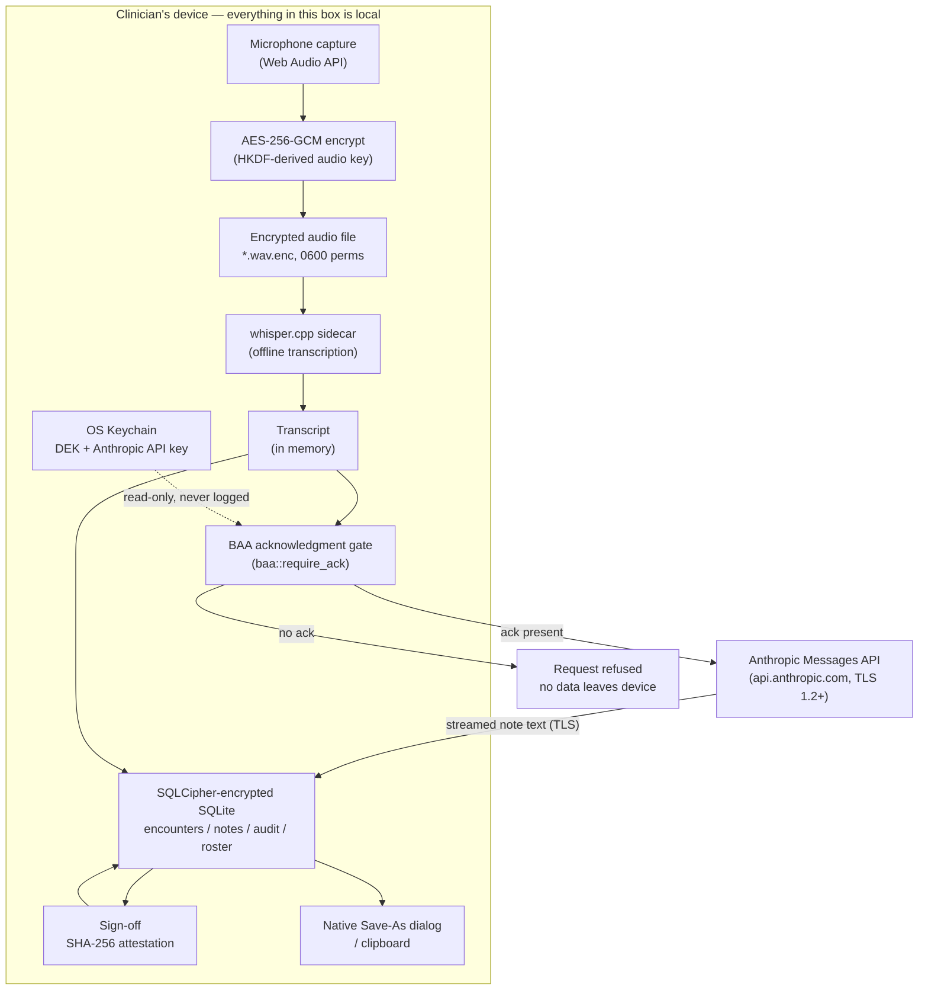
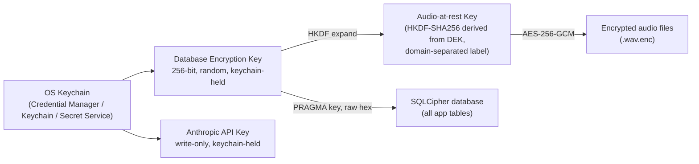

# Tahlk — PHI Data Flow and Security Controls

**Prepared for:** HIPAA compliance review / auditor walkthrough
**Prepared by:** Greenbar Systems (Tahlk product team)
**Product & version covered:** Tahlk Solo desktop application, v0.1.1 (Tauri 2.0, `com.tahlk.app`)
**As of:** 2026-07-15
**Scope:** This document describes the *shipping* Solo desktop product only. The multi-tenant sync server (`server/`, Group tier) is frozen by architectural decision (`docs/adr/0001-freeze-group-tier-and-sync.md`), has no deployment and no customer, and is out of scope for this walkthrough — it holds no PHI today.

---

## 1. What Tahlk is, in one paragraph

Tahlk is a local-first desktop application for behavioral health and psychiatry clinicians. It records a clinical encounter, transcribes it *entirely on-device* using a bundled speech-recognition model, sends the transcript to Anthropic's Claude API to draft a structured clinical note, and requires the clinician to review and sign that note before it is considered final. There is no Tahlk-operated server in the Solo product's data path. The only third party in the data flow is Anthropic, and only for the single step of note drafting.

---

## 2. System components

| Component | Role | PHI-bearing? |
|---|---|---|
| WebView UI (`src/`) | Renders the app; runs entirely on the clinician's device | Transiently, in memory |
| Rust/Tauri backend (`src-tauri/`) | Owns all disk I/O, encryption, and the one external network call | Yes — this is the trust boundary |
| Local SQLite database (SQLCipher-encrypted) | Encounters, notes, patient roster, audit trail | Yes, encrypted at rest |
| Local filesystem (audio directory) | Encrypted session recordings | Yes, encrypted at rest |
| OS keychain (Credential Manager / Keychain / Secret Service) | Holds the database encryption key and the Anthropic API key | No PHI; holds the keys that protect PHI |
| whisper.cpp (bundled sidecar binary) | Local speech-to-text | Yes, transiently, on-device only |
| Anthropic Messages API (`api.anthropic.com`) | Drafts the clinical note from the transcript | Yes, in transit, under TLS |

The WebView is treated as an **untrusted boundary** throughout the backend's design — every command it can call is validated as if a compromised frontend were attacking the Rust layer, because a WebView-based desktop app inherits that threat model by construction (XSS, a malicious dependency, a supply-chain compromise of a JS package). This shapes several of the controls described below.

---

## 3. Data flow

The sections below walk each stage with the exact control in force and where it lives in the codebase.

### 3.1 Capture

The clinician starts a recording; audio is captured locally via the Web Audio API. Nothing leaves the device at this stage.

### 3.2 Encryption before the first disk write

Session audio is encrypted **before it is ever written to disk** — there is no plaintext-audio-on-disk window in current code. The key used is not the database key itself: it is a separate 256-bit key derived from the database encryption key (DEK) via HKDF-SHA256 with a fixed, domain-separating label, so a weakness confined to one use (database vs. audio) cannot compromise the other (`src-tauri/src/audio_crypto.rs:33-84`). Each file is AES-256-GCM encrypted with a fresh random 96-bit nonce (never reused), and the GCM authentication tag means a corrupted or tampered file fails to decrypt rather than silently returning garbage (`audio_crypto.rs:107-129`). On disk the file carries a `.wav.enc` extension and is permissioned `0600` (owner-read/write only) on Unix (`src-tauri/src/audio.rs:59-91`). Legacy installs that still have plaintext `.wav` files from before this control shipped are migrated automatically and crash-safely on next launch (encrypt → update database pointer → delete plaintext, in that order, so a crash mid-migration never loses data) (`audio_crypto.rs:186-247`).

### 3.3 Local transcription — no network call

Transcription is performed entirely on-device by a bundled `whisper.cpp` sidecar binary against a local model file (`resources/ggml-base.en.bin`, shipped with the app per `src-tauri/tauri.conf.json`). The JS-side transcription module's own comment states the guarantee plainly: *"Audio stays on-device; no network call is made"* (`src/scribe/transcriber.js:1-3`). The resulting transcript exists in memory and, once persisted, inside the encrypted database — never on disk in plaintext during this step.

### 3.4 Note generation — the one point PHI leaves the device

This is the only step in the product where PHI crosses the network, and it is the most heavily controlled step in the codebase.

- **Compliance gate runs first, before anything else.** `generate_note`'s very first statement is `baa::require_ack(&state)?` — strictly before the API key is read, before an HTTP client is built, before the transcript is touched in any way (`src-tauri/src/notes.rs:339-343`). If the clinician has not affirmatively attested that the Anthropic account behind their key is covered by a BAA, the call is refused and no transcript content leaves the device. This ordering is deliberate and is enforced in the compiled Rust binary, not just in UI copy — a compromised WebView cannot skip it by bypassing a JS-side modal.
- **Minimum necessary data.** The outbound request body contains exactly three things: the model name, the transcript (wrapped in `<transcript>` delimiters), and a system prompt (`notes.rs:365-374`). No patient name, date of birth, encounter ID, or any other identifier is included in the payload sent to Anthropic — the encounter ID and provider ID are used only in Tahlk's own local audit row, never transmitted.
- **Prompt-injection defense.** Because a session transcript is untrusted input (anything said in the room, including by a bad actor with mic access, is shipped verbatim to the model), the transcript is wrapped in explicit `<transcript>` tags and the system prompt is prepended with a directive instructing the model to treat the enclosed text as data to summarize, never as instructions to obey (`notes.rs:128-170`).
- **Transport security.** TLS 1.2 minimum is enforced on the HTTP client (`notes.rs:274-280`), with bounded timeouts (10s connect / 120s total) so a hung upstream connection cannot stall the app indefinitely (`notes.rs:56-61`), and a hard cap on how many response bytes are accumulated from the stream, defending against a malicious or misbehaving server (`notes.rs:63-` area).
- **Credential handling.** The Anthropic API key never lives in the application database. It is stored exclusively in the OS keychain via the `keyring` crate, is write-only across the JS↔Rust boundary (there is no code path anywhere that reads it back out to JS), and is explicitly walled off from the app's generic key-value storage API by an allowlist that is unit-tested to stay in sync (`src-tauri/src/secrets.rs:1-16, 88-127`).
- **Audit trail of the call itself.** Every completed call — success or failure — is written to a dedicated, append-only `llm_audit` table: timestamp, encounter ID, provider ID, model, endpoint, request/response byte counts, upstream request-id, and outcome. **Content is deliberately excluded** — no transcript, no note text — specifically so the audit log itself never becomes a second copy of PHI that then needs its own protection (`src-tauri/src/llm_audit.rs:1-25, 62-92`).

### 3.5 Storage at rest

Every table in the application — encounters, the patient roster, the note history / audit chain, the LLM call log, and general application settings — lives in a single SQLite database file that is whole-database encrypted with SQLCipher. The 256-bit encryption key (DEK) is generated once via a cryptographically secure random generator on first launch and stored in the OS keychain; it is never derived from a password and never touches disk in plaintext form (`src-tauri/src/db_key.rs:1-13, 44-70`). Every pooled database connection is keyed before it is handed to any application code, and a wrong or missing key fails the connection outright rather than silently returning an unusable or unencrypted handle (`src-tauri/src/db.rs:178-201`). The database file itself is permissioned `0600` on Unix (`db.rs:290`). Any legacy plaintext database from before this control shipped is migrated the same crash-safe way as audio, and the old plaintext file is zero-overwritten before being unlinked (`db.rs:230-268`).

### 3.6 Sign-off — tamper-evidence

When a clinician signs a note, Tahlk computes a SHA-256 hash over the exact transcript, note content, signer identity, and encounter ID at that moment (`src/utils/contentHash.js:19-25`). Any edit made after signing produces a different hash, so a silently altered "signed" note is detectable. Every meaningful lifecycle event (generated, edited, signed, exported) is additionally recorded in a hash-chained history table — each entry's hash incorporates the previous entry's hash, so removing or altering a past entry breaks the chain in a way a verifier can detect (`note_history.rs` schema; chain verification logic in `contentHash.js:33-63`). Once signed, the audio file reference on that record is frozen against being silently repointed at a different recording, with one narrow, intentional exception: the at-rest encryption migration is permitted to rewrite the file *extension* (`.wav` → `.wav.enc`) on the *same underlying recording*, never to a different file (`audio_crypto.rs:151-165`).

### 3.7 Export

Exporting a note goes through the operating system's native Save dialog — the clinician actively chooses the destination; there is no Tahlk-controlled upload endpoint in this path (`src-tauri/src/export.rs:1-30`). The exported file is plain text/PDF by design (not re-encrypted at export), because at that point the clinician has explicitly directed the content outside the app's protection boundary — the same as printing a document or copying it to a USB drive is outside any EHR's control once exported. This is a deliberate, provider-directed boundary, not an oversight, and it mirrors how any clinical software's "export" function necessarily works.

### 3.8 Retention and disposal

Session audio retention is configurable: the default (`keep`) preserves the recording after signing so it remains available for later re-transcription; the alternative (`delete_on_sign`) best-effort deletes the `.wav.enc` file immediately after a successful sign and records the outcome in the audit log, without ever rolling back a successful sign if the delete itself fails (`src/domain/retention.js:1-25`). **Known open item, tracked and self-disclosed:** there is currently no time-based retention/expiry policy, and no capability to fully delete a signed note, transcript, or entire encounter record on request — only the standalone patient-roster row is deletable today. This is a real gap against state medical-record-destruction statutes and patient deletion rights, and it is on the product roadmap rather than hidden.

### 3.9 Diagnostics

A separate, opt-in (default off) diagnostics log records app-level events only — counts, durations, error types — and is explicitly documented and CI-checked to exclude PHI content. It exists purely to help the clinician get support; nothing in it is transmitted automatically.

---

## 4. Access control and identity

Tahlk Solo is single-local-user desktop software: there is no login, password, or session layer of its own, by design. The operating system user account is the actual identity boundary — the same model any other single-user desktop application on a clinician's own machine relies on. The provider's name entered during setup is a self-reported label used to stamp audit and attestation records for readability; it is not, and is not claimed to be, a cryptographically verified identity. **Recommended operational control (outside the app):** each clinician should have their own OS user account and should not share a single Tahlk installation across multiple providers, since the audit trail's provider label would not reliably distinguish who performed which action in that scenario.

---

## 5. Key hierarchy

The database key and the audio key are cryptographically independent despite both descending from the same root secret, so a weakness specific to one use case does not automatically compromise the other. Both ultimately rely on the OS keychain as the single root of trust; if the keychain itself is compromised, the database is too — this trade-off is deliberate and documented in the source rather than hidden, and full-disk encryption (BitLocker/FileVault) is recommended as a complementary, not a substitute, control.

---

## 6. Network egress boundary

The WebView's Content Security Policy is locked down to `connect-src 'self' ipc: http://ipc.localhost` (`src-tauri/tauri.conf.json`) — the frontend cannot make its own network request to Anthropic or anywhere else, even under an XSS condition. The **only** code path that reaches the public internet is the one Rust function described in §3.4, which runs in the trusted backend, not the WebView.

---

## 7. Audit logging — current state, stated plainly

Per 45 CFR §164.312(b), audit controls must record and examine activity involving ePHI. Tahlk's audit coverage today is **partial**, and we are disclosing the gaps here rather than presenting only the parts that are complete:

**Solid today:**
- Every Anthropic API call (success or failure) is recorded in the Rust-owned `llm_audit` table, which the generic key-value storage API cannot reach or delete (§3.4).
- Note lifecycle events (generated / edited / signed / exported) are recorded in a hash-chained history table designed so tampering is detectable.

**Open items, tracked, not hidden:**
- A broader JS-side activity log (view/open/export-style events) is currently stored in the same general-purpose key-value table the rest of the app's settings use, and is reachable — and therefore erasable or forgeable — through the app's own generic storage commands. This does not require breaching encryption; it requires the same WebView-compromise threat model the rest of the app's design otherwise defends against.
- Patient roster record creation, edits, and deletion currently write **no** audit entry at all, despite the delete confirmation in the UI describing the action as "permanent." This is the one entity in the app with zero audit coverage today.

Both items are recognized, scoped remediation items, not unknowns — flagging them here is consistent with how this product's compliance documentation is maintained generally (see `docs/security/hipaa-risk-assessment.md`).

---

## 8. Business Associate Agreement status

Under the **managed-key model** this product is built around, the compliance chain is: the practice (Covered Entity) → **Greenbar Systems** (Business Associate, under a provider↔Greenbar BAA, alongside a EULA) → Anthropic (Greenbar's subcontractor, under Greenbar's own BAA with Anthropic). Two BAA relationships matter, and their status should not be conflated:

1. **Provider ↔ Greenbar (BAA + EULA).** Required before a practice uses real patient information. The in-app confirmation gate (§3.4) records that the practice has accepted these agreements, with a timestamp, for the practice's own audit trail. Software cannot verify the underlying legal agreements exist — only that the clinician confirmed them. **Status: in attorney drafting, week of 2026-07-13.** A licensed healthcare attorney is drafting both the BAA and the EULA; neither is executed with any practice yet. Real-PHI beta invitations must not go out until the attorney-reviewed drafts are finalized and signed with the receiving practice.
2. **Greenbar ↔ Anthropic (subcontractor BAA).** Required because Anthropic processes PHI on Greenbar's behalf in the managed chain. **Status: executed 2026-07-18. Zero-Data-Retention (ZDR) provisioning on the dedicated Anthropic organization behind the future managed-key proxy is pending Anthropic approval** — the BAA is signed, but ZDR must be provisioned on the org before the `TAHLK_ANTHROPIC_KEY` referenced in `MANAGED-KEY-PROXY-CONTRACT.md` §3 and §7 is usable for real-PHI traffic. Update this line — with the Anthropic-provided approval date — the moment ZDR is confirmed active on the org.

**Current implementation vs. the model.** The managed-key proxy (`MANAGED-KEY-PROXY-CONTRACT.md`, v1 draft) is **not built**. During the current test-data-only beta the transcript is sent using a provider-supplied Anthropic key entered in the app (bring-your-own-key) as a **transitional mechanism**, not the end-state. Real-PHI use is not supported until both BAAs above are executed and the managed proxy ships.

**Beta gate status.** Per `docs/adr/0003-disable-baa-gate-for-beta.md` (merged), the confirmation gate described in §3.4 is currently **non-blocking** for the test-data-only beta — `baa::GATE_ENABLED = false`, so a missing confirmation does not stop note generation on test data. It re-enables (`GATE_ENABLED = true`) before real patient use. This document and `docs/security/hipaa-risk-assessment.md` must both be updated whenever that flag changes; do not rely on this section without checking the code state directly.

---

## 9. Summary of residual risk

| Area | Status |
|---|---|
| Encryption at rest (database, audio) | Strong — AES-256/SQLCipher, keychain-held keys, verified by round-trip tests |
| Encryption in transit | Strong — TLS 1.2+ enforced on the one external call |
| Minimum necessary data to third party | Strong — verified no identifiers in the Anthropic payload |
| Compliance gate ordering | Strong — enforced before any network I/O, not just in UI |
| API key handling | Strong — write-only, keychain-only, walled off from generic storage |
| Audit logging — LLM calls | Strong |
| Audit logging — general activity log | **Gap** — forgeable via generic storage commands |
| Audit logging — patient record CRUD | **Gap** — no coverage today |
| Record deletion / right-to-delete | **Gap** — no full-record deletion capability yet |
| Screen-capture exposure | **Gap** — no content-protection flag; screen-share tools can capture on-screen PHI |
| Clipboard handling | **Partial** — auto-clears after a window, but not on app quit |
| Provider ↔ Greenbar BAA + EULA | In attorney drafting (week of 2026-07-13); not yet executed with any practice. In-app confirmation records provider acknowledgment; software cannot verify the underlying legal agreements |
| Greenbar ↔ Anthropic (subcontractor) BAA | Executed 2026-07-18. ZDR provisioning on the dedicated Anthropic org pending Anthropic approval — required before the managed-key proxy can route real-PHI traffic |
| Incident response runbook | **Gap** — self-disclosed, planned, not yet built |

None of the open items above involve a failure of the encryption or transport controls themselves; they are accountability and completeness gaps layered on top of a sound cryptographic foundation, which is the honest characterization we would give an auditor asking us directly.

---

## 10. Document control

- This document should be re-reviewed at minimum every 6 months, or immediately upon any change to: the Anthropic BAA status (either relationship in §8), the BAA gate's enforcement state, or any change to the encryption/key-management code cited above.
- Source of truth for every claim in this document is the cited file and line range in the current codebase — if code and document disagree, the code is authoritative and this document is stale and must be corrected, not the reverse.
- Companion documents: `docs/security/hipaa-risk-assessment.md` (full risk register), `docs/security/pre-deploy-checklist.md` (Group-tier server, not in scope here), `docs/adr/0003-disable-baa-gate-for-beta.md`.
